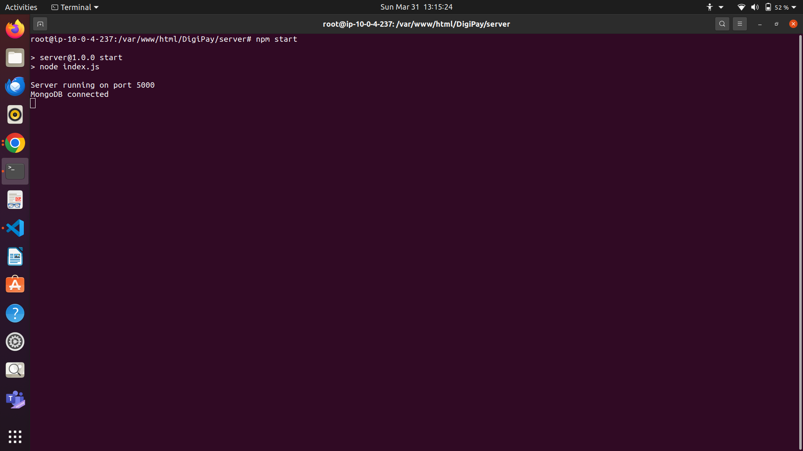
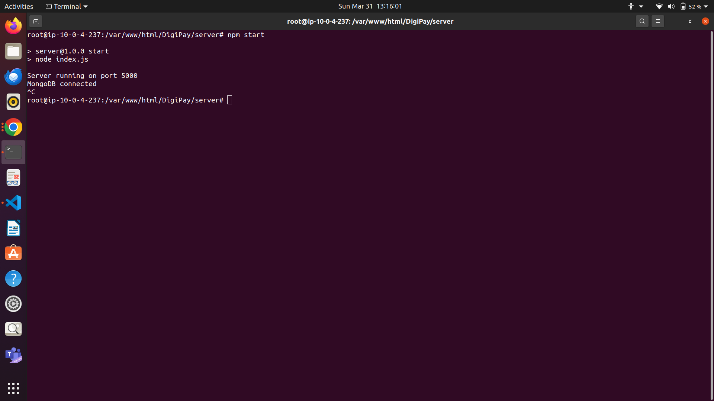
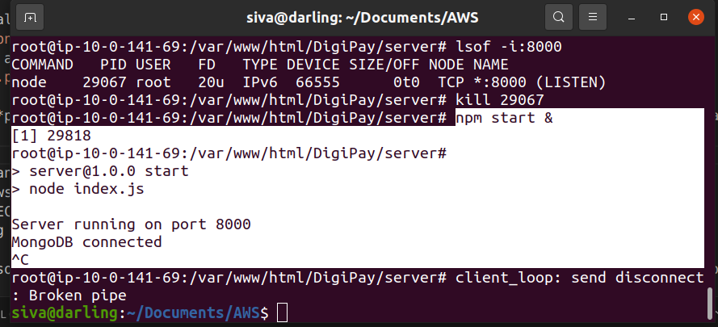

## DevOps: Deploying and Managing Services

I deployed the DigiPay application on an AWS EC2 instance, accessible via `http://<instance-public-address>:<port>/`. Initially, the subnet in the VPC allowed all traffic by default according to NACL, but the security group for the instance only allowed the SSH port. This configuration enabled terminal login to the instance to run applications on desired ports (e.g., DigiPay on port 5000). Although port 5000 was permitted by NACL, it had not yet been allowed by security groups, making it inaccessible until the inbound traffic rules were edited to allow custom TCP port 5000 from anywhere (IPv4). After making this change, the application started running successfully.

**Note:** The link might not work if I stop running the instance since the IP address changes whenever we restart it after stopping.

### Server and Application Status Illustrations

|  |  |
|:-------------------------------------------------:|:------------------------------------------------------------:|
|     **Figure 1:** Server Running in EC2 Instance on Port 5000     |    **Figure 2:** Application Running in Browser on `http://<instance-public-ip-address>:5000`  |

|  |  |
|:--------------------------------------------------:|:------------------------------------------------------------:|
|          **Figure 3:** Server Stopped Running in EC2 Instance              |     **Figure 4:** Application Stopped Running in Browser             |

Running the server in the background (`npm start &`) allows the application to continue running even after terminating the terminal session:

  
**Figure 5:** Server Running in Background

## Autoscaling and Load Balancer: Accessing Private Subnets

### Reference Architecture Diagram

Below is the architecture diagram I am implementing (S3 Gateway ignored for this setup):

  

### 1. Creating a VPC

Configured with 2 availability zones, 2 public subnets, 2 private subnets, and 1 NAT Gateway per availability zone (65536 IPs total), we established a basic layout as shown in the architecture diagram, intending to create an autoscaling group and load balancer later.

**Public Subnets Attachment:**

  
**Public subnets attached to the route table and the Internet Gateway.**

**Private Subnets Attachment to NAT Gateways:**

  
**Private subnets attached to different route tables and to NAT Gateways in public subnets.**

### 2. Creating an Autoscaling Group in the VPC

- First, launch a template to configure the ports allowed for the instances we create and specify the VPC for launching this autoscaling.
- After creating the template, while creating the autoscaling group, I configured 2 EC2 instances to be in 2 private subnets.
- I did not attach any load balancer yet; I planned to create it later in the public subnets.
- The autoscaling feature dynamically creates more instances if there is significant incoming traffic and can remove instances if the traffic decreases.
- I created a desired capacity of 2 instances (to start with 2 instances) and configured the maximum instances it can go up to during peak times to be 4, with a minimum of 1.
- After creating the autoscaling group, we checked whether it created two instances for us in two private subnets (in my region ap-south-1, one instance needed in private ap-south-1a, the other in private ap-south-1b as configured earlier in the autoscaling creation).

  
**Auto Scaling Group Configuration**

**The question arises: since we don't have public IPv4 addresses for these instances created in private subnets, how do I log in to those instances, as I intend to run my servers there?**

- I created a bastion host instance, which can act as a mediator between public and private subnets.
- Within the VPC, I launched this bastion host, giving permission to allow SSH port (where we log in) and enabled auto-assign public IP address, as we need to log in using that.
- After launching the host instance, I first log into this host instance and from there, I log into the private instance.

**But to log in, I need an encrypted key, right? I have that locally to log into the host instance, but how do I log into the private instance without this key?**

**What I did was copy the key from my local machine to the host instance using SCP (Secure Copy Protocol):**

  

- After logging into the host using its public IPv4 address, I can see the key there, which I use to log into the private instance (the instance in the private subnet) using its private IP address.

  
  
  

- I ran my server inside that private instance. For now, I am running the server only in 1 private instance, and there is no server in the other instance.

### 3. Creating a Load Balancer and Mapping It to Two Public Subnets in the VPC

- I created an Application Load Balancer (Layer 7 Load Balancer), configured the VPC, and set up a security group to allow specific traffic.
- The security group I added allows SSH port 22 and HTTP port 8000, where I am running the server.
- I then created a target group with specific instances selected to support load balancing (using HTTP port 8000, as already allowed).
- Next, I created the Load Balancer by mapping it to both public subnets and attached the target group we created, leaving the accessible port of the load balancer as 80 (HTTP port 80) for now.
- The load balancer was created, but initially, it showed that port 80 was not accessible as we hadn't allowed HTTP port 80 in any security group yet.
- After changing the configuration of the load balancer's security group to allow traffic from HTTP port 80, that error was resolved :)

### 4. Implementing the Full Architecture

The DNS name abstracts the IP addresses of the individual servers behind the load balancer. Users or client applications don't need to know about the specific servers or their IP addresses; they only need to know the DNS name.

**Accessing the Server Using the DNS Name in the Load Balancer:**

  

Remember, I am currently running the server in one private instance only; the other is marked as unhealthy in the target group.

  

The target group performs health checks and only forwards requests to healthy load balancers. If we disable that health check, then it sends the server request to both instances, resulting in intermittent errors.

### Let's Try Using Another Python Basic Server in the Other Instance and Check What Happens

The DNS Name Link in the Load Balancer, through which one can access the servers and send requests for accessing servers, is: [http://project-example-286412306.ap-south-1.elb.amazonaws.com/](http://project-example-286412306.ap-south-1.elb.amazonaws.com/)

As mentioned, the health check fails in the target group and always sends the request to the healthy instance.

  

Now, as I logged into the 2nd private instance and ran a simple HTML page using python3 on server port 8000:

  

The target group's health check succeeds, and this instance also becomes healthy, allowing requests to be sent evenly to both servers (located in private instances).

  

Now, if we see, sometimes the link directs to the application (running in the private instance in the private subnet south-1a):

  

And sometimes, the link directs to this page, where I ran using python3 in the 2nd private instance in the private subnet south-1b:

  

## After Building Docker Image and Running Docker Container, Allowing 5001 Port Inbound to the EC2 Instance

Here I can access my application: [http://15.207.254.182:5001/](http://15.207.254.182:5001/)

This link is accessible until the instance's IP address changes (i.e., when we stop and start the instance again).
