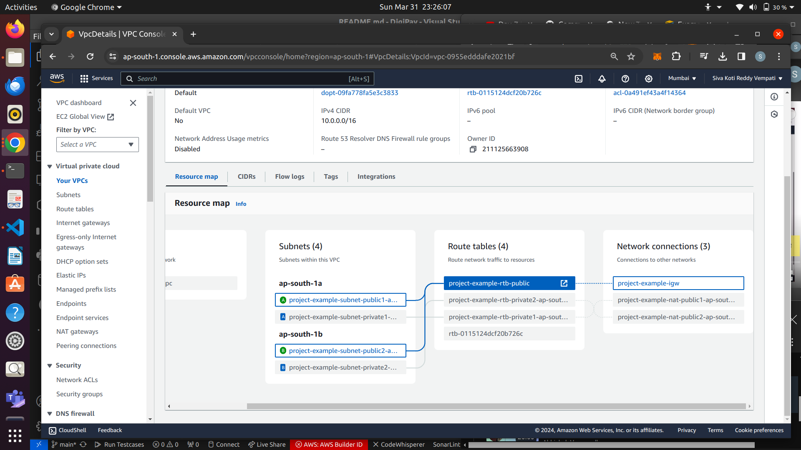
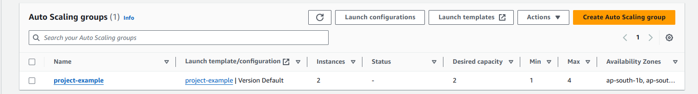
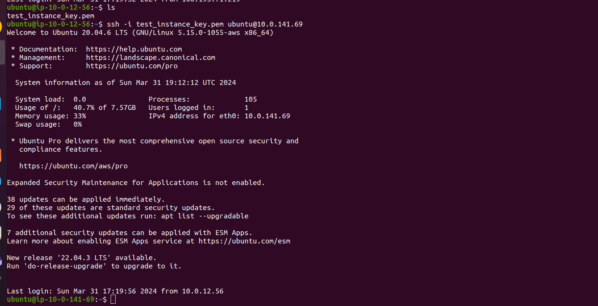
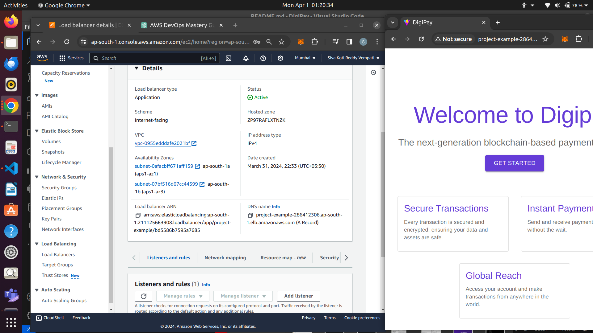
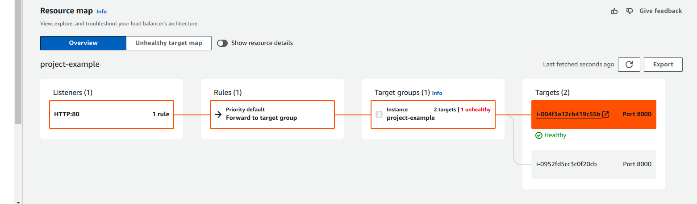

# Digipay

## A Blockchain-Based Wallet Website

Digipay aims to familiarize users with blockchain and Web3 functionalities by integrating with MetaMask, enabling transactions through a custom website wallet, and leveraging Superfluid for stream transactions. The project features a robust user system with registration, login capabilities, transaction history, and the generation and utilization of test tokens for transactions.

## Features

1. **MetaMask Integration**: Encourages users to connect their MetaMask wallet upon visiting the website.
2. **Display Account Details**: Shows the connected MetaMask account's address and balance.
3. **Website Wallet Functionality**: Allows users to send cryptocurrency from their MetaMask account to another recipient's address, with transactions recorded on the blockchain.
4. **Transaction History**: Displays a history of all user transactions made through the website.
5. **User Authentication System**: Features a registration and login system, with MongoDB as the database backend. Registration requires unique email addresses. Transactions can be filtered by the user's email address, stored securely within blockchain transactions.
6. **Superfluid Integration**: Implements a separate wallet feature using Superfluid for creating, updating, and deleting money flows.
7. **Test Token Generation**: Enables users to generate test tokens for transaction testing.
8. **Educational Content**: Provides information on blockchain and Web3 to educate users about the technology and its implications.
9. **Superfluid Wallet Functions**: Offers detailed functionalities for creating, updating, and deleting flows with Superfluid.

## Technology Stack

- **Frontend**: React, Vite
- **Blockchain Interaction**: Ethers.js, Solidity for smart contracts
- **Backend**: Node.js, Express.js for server-side logic
- **Database**: MongoDB
- **Blockchain Technologies**: MetaMask, Superfluid
- **Testing**: Hardhat for smart contract testing

## Version 1

This Web Application currently interacts primarily with MATIC, as the contract is designed for operations with the native token, and the RPC URL connects to the Mumbai network, where MATIC serves as the native currency.

## Deployed on Render

[https://digipay-app.onrender.com](https://digipay-app.onrender.com)

## Network Deployment Summary

- **Mumbai**:
  - TransactionRecorder deployed to: `contract_address`
- **Polygon Mainnet**:
  - Insufficient funds for deployment.
- **Ethereum Mainnet**:
  - Insufficient funds for deployment.
- **Goerli Testnet**:
  - Insufficient funds for deployment. Note: Receiving Goerli ETH requires a minimum balance of 0.001 ETH on mainnet.
- **Sepolia Testnet**:
  - Network errors and insufficient funds reported during deployment.
- **Linea Mainnet**:
  - Insufficient funds for deployment.

Currently, the application utilizes a contract deployed on the Mumbai network, supported by limited Mumbai faucet MATIC tokens.

## Version 2

### Integration with Superfluid Completed

- Access the updated application: [https://digipay-app.onrender.com](https://digipay-app.onrender.com)
- Users can now create, update, and delete streams.
- **User Note**: For Superfluid transactions, utilize Super Tokens (e.g., fDAIx). Visit [Superfluid App](https://app.superfluid.finance/) for token conversion. Ensure interaction with the correct token type.

### Demo Video Link (v2)

- [Watch Here](https://drive.google.com/file/d/1Qd6dz5NZS1ayRQt6LF4xotTaXZbnT_e8/view?usp=drivesdk)

## Version 3

- Implemented a contract for ERC20 DIGI tokens, claimable by Digi App users for testing purposes.
- Claim limit: 100 tokens per week, applicable for accounts holding less than 100 DIGI tokens.
- **Future Goals**: Enable transactions with DIGI Tokens within the application and develop a wrapping function for Superfluid interactions.


## DevOps: Deploying and Managing Services

I deployed the DigiPay application on an AWS EC2 instance, accessible via `http://<instance-public-address>:<port>/`. Initially, the subnet in the VPC allowed all traffic by default according to NACL, but the security group for the instance only allowed the SSH port. This configuration enabled terminal login to the instance to run applications on desired ports (e.g., DigiPay on port 5000). Although port 5000 was permitted by NACL, it had not yet been allowed by security groups, making it inaccessible until the inbound traffic rules were edited to allow custom TCP port 5000 from anywhere (IPv4). After making this change, the application started running successfully.

**Note:** The link might not work if I stop running the instance since the IP address changes whenever we restart it after stopping.

### Server and Application Status Illustrations

|  |  |
|:-------------------------------------------------:|:------------------------------------------------------------:|
|     **Figure 1:** Server Running in EC2 Instance on Port 5000     |    **Figure 2:** Application Running in Browser on `http://<instance-public-ip-address>:5000`  |

|  |  |
|:--------------------------------------------------:|:------------------------------------------------------------:|
|          **Figure 3:** Server Stopped Running in EC2 Instance              |     **Figure 4:** Application Stopped Running in Browser             |

Running the server in the background (`npm start &`) allows the application to continue running even after terminating the terminal session:

  
**Figure 5:** Server Running in Background

## Autoscaling and Load Balancer: Accessing Private Subnets

### Reference Architecture Diagram

Below is the architecture diagram I am implementing (S3 Gateway ignored for this setup):

  

### 1. Creating a VPC

Configured with 2 availability zones, 2 public subnets, 2 private subnets, and 1 NAT Gateway per availability zone (65536 IPs total), we established a basic layout as shown in the architecture diagram, intending to create an autoscaling group and load balancer later.

**Public Subnets Attachment:**

  
**Public subnets attached to the route table and the Internet Gateway.**

**Private Subnets Attachment to NAT Gateways:**

  
**Private subnets attached to different route tables and to NAT Gateways in public subnets.**

### 2. Creating an Autoscaling Group in the VPC

- First, launch a template to configure the ports allowed for the instances we create and specify the VPC for launching this autoscaling.
- After creating the template, while creating the autoscaling group, I configured 2 EC2 instances to be in 2 private subnets.
- I did not attach any load balancer yet; I planned to create it later in the public subnets.
- The autoscaling feature dynamically creates more instances if there is significant incoming traffic and can remove instances if the traffic decreases.
- I created a desired capacity of 2 instances (to start with 2 instances) and configured the maximum instances it can go up to during peak times to be 4, with a minimum of 1.
- After creating the autoscaling group, we checked whether it created two instances for us in two private subnets (in my region ap-south-1, one instance needed in private ap-south-1a, the other in private ap-south-1b as configured earlier in the autoscaling creation).

  
**Auto Scaling Group Configuration**

**The question arises: since we don't have public IPv4 addresses for these instances created in private subnets, how do I log in to those instances, as I intend to run my servers there?**

- I created a bastion host instance, which can act as a mediator between public and private subnets.
- Within the VPC, I launched this bastion host, giving permission to allow SSH port (where we log in) and enabled auto-assign public IP address, as we need to log in using that.
- After launching the host instance, I first log into this host instance and from there, I log into the private instance.

**But to log in, I need an encrypted key, right? I have that locally to log into the host instance, but how do I log into the private instance without this key?**

**What I did was copy the key from my local machine to the host instance using SCP (Secure Copy Protocol):**

  

- After logging into the host using its public IPv4 address, I can see the key there, which I use to log into the private instance (the instance in the private subnet) using its private IP address.

  
  
  

- I ran my server inside that private instance. For now, I am running the server only in 1 private instance, and there is no server in the other instance.

### 3. Creating a Load Balancer and Mapping It to Two Public Subnets in the VPC

- I created an Application Load Balancer (Layer 7 Load Balancer), configured the VPC, and set up a security group to allow specific traffic.
- The security group I added allows SSH port 22 and HTTP port 8000, where I am running the server.
- I then created a target group with specific instances selected to support load balancing (using HTTP port 8000, as already allowed).
- Next, I created the Load Balancer by mapping it to both public subnets and attached the target group we created, leaving the accessible port of the load balancer as 80 (HTTP port 80) for now.
- The load balancer was created, but initially, it showed that port 80 was not accessible as we hadn't allowed HTTP port 80 in any security group yet.
- After changing the configuration of the load balancer's security group to allow traffic from HTTP port 80, that error was resolved :)

### 4. Implementing the Full Architecture

The DNS name abstracts the IP addresses of the individual servers behind the load balancer. Users or client applications don't need to know about the specific servers or their IP addresses; they only need to know the DNS name.

**Accessing the Server Using the DNS Name in the Load Balancer:**

  

Remember, I am currently running the server in one private instance only; the other is marked as unhealthy in the target group.

  

The target group performs health checks and only forwards requests to healthy load balancers. If we disable that health check, then it sends the server request to both instances, resulting in intermittent errors.

### Let's Try Using Another Python Basic Server in the Other Instance and Check What Happens

The DNS Name Link in the Load Balancer, through which one can access the servers and send requests for accessing servers, is: [http://project-example-286412306.ap-south-1.elb.amazonaws.com/](http://project-example-286412306.ap-south-1.elb.amazonaws.com/)

As mentioned, the health check fails in the target group and always sends the request to the healthy instance.

  

Now, as I logged into the 2nd private instance and ran a simple HTML page using python3 on server port 8000:

  

The target group's health check succeeds, and this instance also becomes healthy, allowing requests to be sent evenly to both servers (located in private instances).

  

Now, if we see, sometimes the link directs to the application (running in the private instance in the private subnet south-1a):

  

And sometimes, the link directs to this page, where I ran using python3 in the 2nd private instance in the private subnet south-1b:

  

## After Building Docker Image and Running Docker Container, Allowing 5001 Port Inbound to the EC2 Instance

Here I can access my application: [http://15.207.254.182:5001/](http://15.207.254.182:5001/)

This link is accessible until the instance's IP address changes (i.e., when we stop and start the instance again).


## DevOps: Deploying and Managing Services with CI/CD

This outlines the deployment of a web application leveraging Docker for containerization, Jenkins for CI/CD pipeline automation, Kubernetes for orchestration, and Helm for application deployment management. The process ensures a smooth, automated transition from code commit to production deployment.

### Containerizing the Application with Docker

To containerize our web application DigiPay, we use the following `Dockerfile`, which prepares both the server environment and the client application within a single Docker image.


```dockerfile
FROM node:20.11.1

# Set the working directory for the server
WORKDIR /usr/src/app/server

# Copy package.json and package-lock.json (if available) for the server
COPY server/package*.json ./

# Install server dependencies
RUN npm install
RUN npm install cors

# Copy the server source code into the container
COPY server/ ./

# Set the working directory back to /usr/src/app for client files
WORKDIR /usr/src/app

# Copy the built client application to the container
COPY client/dist ./client/dist

# Expose the port the server listens on
EXPOSE 5001

# Set the working directory again to server to start the server
WORKDIR /usr/src/app/server

# Command to run the server
CMD ["npm", "start"]
```

- Starts with a Node.js environment.
- Prepares the server environment, installs dependencies, and copies the server code.
- Sets up the client by copying the built application files.
- Exposes the server's listening port.
- Defines the command to start the server.

### Building the docker image:

To create the docker image using the above dockerfile, we execute:

```bash

docker build -t username/digipay:latest .
```

To run this container in port 5001 (as we exposed in dockerfile), we use the following command:

```bash

docker run -d -p 5001:5000 --name myserver \
-e DB_CONNECTION_STRING='connection_string' \
-e JWT_SECRET='jwt_secret' \
-e PORT=5000 \
username/digipay:latest
```

This can allow us to access the application in port 5001, if we did this in local, then localhost:5001 or if we did this in instance, then <instance-ip>:5001

Now, from this repository, we can get to know the commands to install Jenkins and we can access that in port 8080 and there we can create a pipeline where we can configure stages by giving Jenkins script there only, or by choosing SCM, where we should have a jenkinsfile in our github repository and we have to configure repository url, branch, path to jenkinsfile and save it and in connfiguration we can build it and see the output in output console.

In general, a jenkinsfile would look like this with stages:

```jenkinsfile

pipeline {
    agent any
    environment {
        DOCKER_IMAGE = 'username/myapp:latest'
        REGISTRY = 'mydockerhubusername/myapp'
    }
    stages {
        stage('Build') {
            steps {
                sh 'docker build -t $DOCKER_IMAGE .'
            }
        }
        stage('Push') {
            steps {
                sh 'docker login --username mydockerhubusername --password mypassword'
                sh 'docker tag $DOCKER_IMAGE $REGISTRY'
                sh 'docker push $REGISTRY'
            }
        }
        stage('Deploy') {
            steps {
                sh 'helm upgrade --install myapp-release helm/myapp --set image.repository=$REGISTRY,image.tag=latest'
            }
        }
    }
}

```

### Deploying with Kubernetes and Helm

- Helm is used to manage the deployment of our Dockerized application on Kubernetes. We create a Helm chart that includes the deployment and service definitions for Kubernetes, configured to use our Docker image.

- The deployment stage in the Jenkins pipeline utilizes Helm to deploy (or update) the application in Kubernetes, pulling the Docker image from the registry.


## AWS: CI/CD:

- We have codecommit (equivalent to github in AWS), codepipeline, codebuild, codedeploy and AWS EKS (k8s) to perform CI/CD in AWS itself (Everything at one place).


## The Best Resources:

### Jenkins end to end CICD Implementation:

[https://youtu.be/JGQI5pkK82w?si=r9FXeWDWTKoBLeFn](https://youtu.be/JGQI5pkK82w?si=r9FXeWDWTKoBLeFn)

### Jenkins Zero to Hero repository by Abhishek Veeramalla:

[https://github.com/iam-veeramalla/Jenkins-Zero-To-Hero/](https://github.com/iam-veeramalla/Jenkins-Zero-To-Hero/)


### AWS Zero to Hero Playlist by Abhishek Veeramalla:

[https://youtube.com/playlist?list=PLdpzxOOAlwvLNOxX0RfndiYSt1Le9azze&si=3I7c_TClLYroTwwG](https://youtube.com/playlist?list=PLdpzxOOAlwvLNOxX0RfndiYSt1Le9azze&si=3I7c_TClLYroTwwG)


# Thank You
