# Digipay

## A Blockchain-Based Wallet Website

This project aims to introduce users to blockchain and Web3 functionalities by integrating with MetaMask, allowing transactions via a custom website wallet, and utilizing Superfluid for stream transactions. It features a comprehensive user system with registration and login capabilities, transaction history, and the generation and use of test tokens for transactions.

## Features

1. **MetaMask Integration**: Prompt users to connect their MetaMask wallet upon visiting the website.
2. **Display Account Details**: Show the connected MetaMask account's address and balance.
3. **Website Wallet Functionality**: Enable users to send cryptocurrency from their MetaMask account to another recipient's address. These transactions are recorded on the blockchain.
4. **Transaction History**: Display a history of all user transactions made through the website.
5. **User Authentication System**: Include a registration and login system, with MongoDB or MySQL as the database backend. Unique email addresses are used for registration. Transactions can be filtered by the user's email address (stored in the blockchain transaction in a secure manner).
6. **Superfluid Integration**: Implement a separate wallet feature using Superfluid for creating, updating, and deleting money flows.
7. **Test Token Generation**: Allow users to generate test tokens for use in transaction testing.
8. **Educational Content**: Provide users with information on blockchain and Web3 to educate them on the technology's uses and implications.
9. **Superfluid Wallet Functions**: Detailed functionalities for creating, updating, and deleting flows with Superfluid.

## Technology Stack

- **Frontend**: React, Vite
- **Blockchain Interaction**: Web3.js or Ethers.js, Solidity for smart contracts
- **Backend**: Node.js, Express.js for server-side logic
- **Database**: MongoDB or MySQL
- **Blockchain Technologies**: MetaMask, Superfluid
- **Testing**: Hardhat or Truffle for smart contract testing

## Version 1:

This Web Application is currently limited to interacting with MATIC because the contract is designed for operations with the native token, and the RPC URL connects to the Mumbai network where MATIC is the native currency.

## Deployed in render

[https://digipay-app.onrender.com](https://digipay-app.onrender.com)

## Network Deployment Summary

- **Mumbai**:

  - TransactionRecorder deployed to: `contract_address`
- **Polygon Mainnet**:

  - Insufficient funds in my wallet account provided to deploy.
- **Ethereum Mainnet**:

  - Insufficient funds in my wallet account provided to deploy.
- **Goerli Testnet**:

  - Insufficient funds in my wallet account provided to deploy.
  - Note: To receive Goerli ETH, your wallet must have a minimum balance of 0.001 ETH on mainnet. Please add ETH to your wallet and try again.
- **Sepolia Testnet**:

  - Taking so much time and giving network errors while adding Sepolia ETH to wallet (not added). So, while deploying the contract for Sepolia RPC, it showed insufficient funds.
- **Linea Mainnet**:

  - Insufficient funds in my wallet account provided to deploy.

For now, I am able to get Mumbai faucet MATIC tokens only, and those I am using now in this application with a contract deployed on the Mumbai network. These tokens are also limited to get sufficient gas amount; if our account already has that much amount, then it won’t give more.

## Version 2:

### Integration with Superfluid is done!.

- You can use the same link: [https://digipay-app.onrender.com](https://digipay-app.onrender.com)
- Now users can create streams, update streams, delete streams
- **Note to Users:** For streaming transactions in Superfluid, ensure you use Super Tokens, typically ending with 'x' (e.g., fDAIx). These tokens are "wrapped" versions of regular tokens, designed for fluid, continuous transactions. To convert regular tokens into Super Tokens or vice versa, visit [Superfluid App](https://app.superfluid.finance/), where you can easily wrap and unwrap tokens for use in streams. Always confirm you're interacting with the correct token for seamless transactions.

### Demo Video Link (v2):

- [Click Here](https://drive.google.com/file/d/1Qd6dz5NZS1ayRQt6LF4xotTaXZbnT_e8/view?usp=drivesdk)

## Version 3:

- Deployed a contract of ERC20 tokens DIGI tokens where a user of Digi App can claim those in the Application for usage, testing purpose.
- An account can claim only 100 tokens per week and the account should also have less than 100 tokens if they are claiming.
- Future Implementations: Want to make transactions done using our Digi Tokens in our application. And want to implement a wrapping function to interact with superfluid with these tokens only.

## Devops (Deploying and Managing Services):

- I deployed this DigiPay application in an AWS EC2 Instance where we can access something like here: http://`<instance-public-address>`:`<port>`/
- At first for subnet in vpc, NACL is by default allowing all traffic, but security group in instance is allowing ssh port only using which we can login in terminal to that instance and run our applications in ports we want (for eg: I run DigiPay in port 5000), and as port 5000 is allowed by nacl now but not yet by security groups. So, it was not opening and after editing inbound traffic where to allow custom tcp port 5000 from anywhere (ipv4). The application started running then.
- **Note:** The link might not work when i stopped running in that instance, and ip address changes whenever we start it after stopping it for sometime.

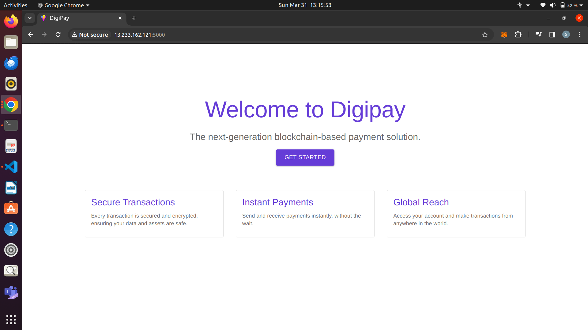
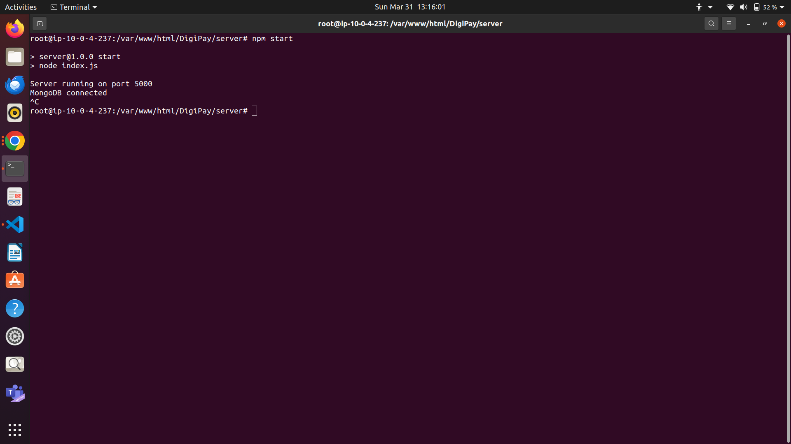
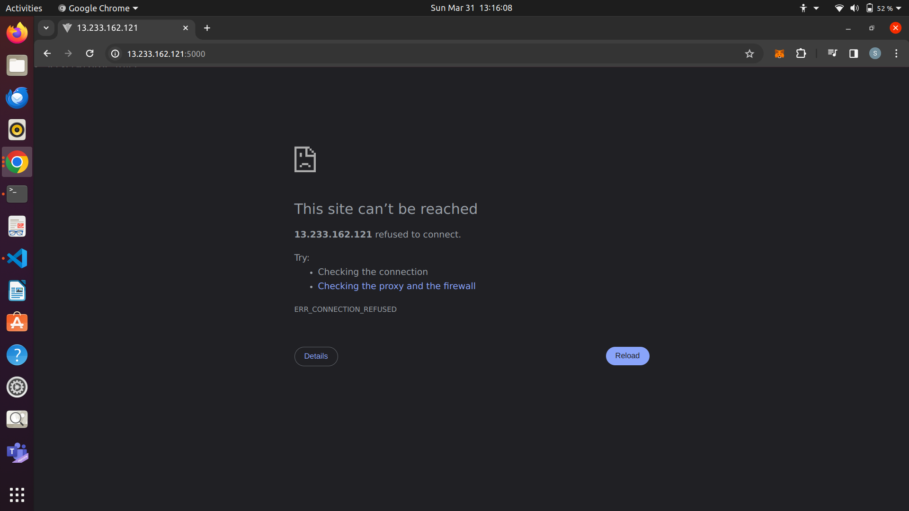

**Figure 1:** Server Running in EC2 Instance on Port 5000
**Figure 2:** Application Running in Browser on  http://`<instance-public-ip-address>`:5000
**Figure 3:** Server stopped Running in EC2 Instance
**Figure 4:** Application stopped Running in Browser

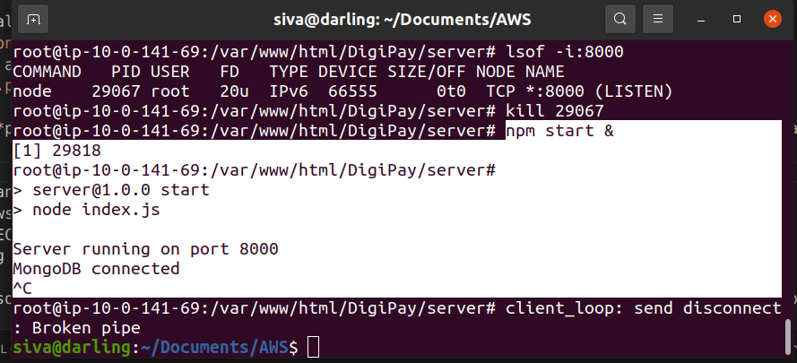

**Figure 5:** If we can run the server in background **placing & after npm start (process running in bacground)**, then even if you terminate there in terminal, the application still runs.

- One problem can be only if I stopped running that instance and if I try to start it again the IP iddress changes and so the link changes.

## Autoscaling and Loadbalancer (accessing private subnets (where we have our servers)):

- **Here is the reference architecture diagram, the same I am implementing:** (Ignore S3 Gateway)

- 

### 1. Creating a VPC (Virtual Private Cloud) where we configure 2 availability zones, 2 public subnets, 2 private subnets and 1 NAT Gateway per availability zone. (Size of the VPC: 65536 ips)
- With this VPC, we created some basic layout as shown in the above architecture for now and will create autoscaling group and load balancer further

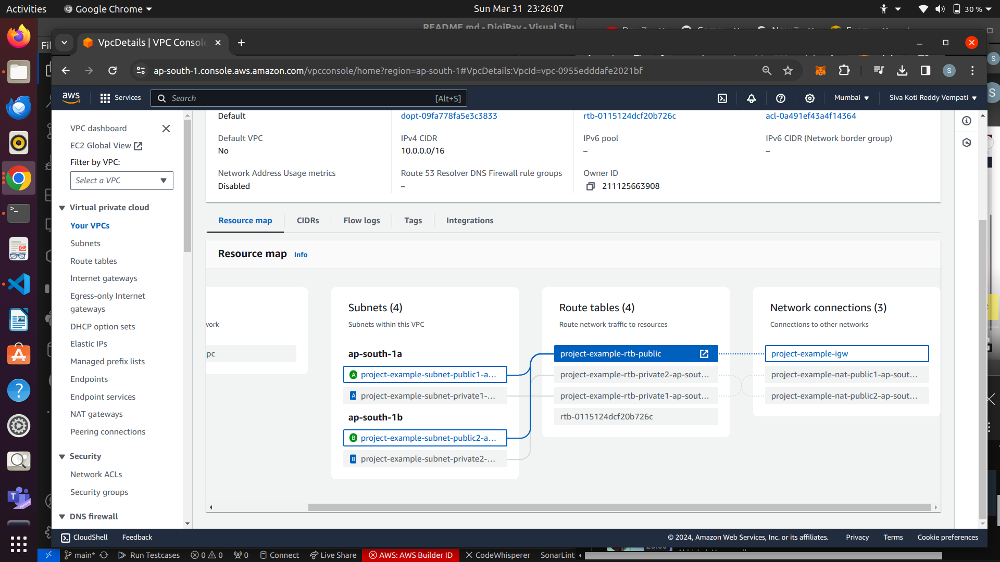

**Public subnets attached to the route table and the internet Gateway**

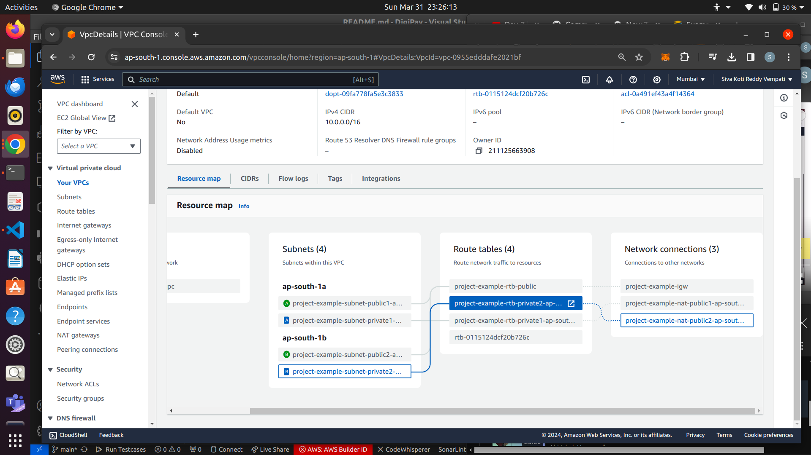

**Private subnets attached to different route tables and to NAT Gateways in public subnets**

**Now, the VPC created subnets, internet gateway, NAT gateways, route tables, routes and associated elastic ip addresses, route tables and verified**

### 2. Creating Autoscaling group in the VPC we created above

- First Launch a template where we will configure what all ports to allow to the instances we create, and in which vpc, we want to launch this autoscaling.
- After creating template, while creating autoscaling group, I configured that I want 2 ec2 instances to be in 2 private subnets.
- I am not attaching any load balancer now, I want to create it later in the public subnets.
- Now, as the name suggests, autoscaling, that means it can dynamically create more instances if there is so much traffic incoming and can remove instances if there is less traffic.
- So, created a desired capacity of 2 instances (to start with 2 instances). And configured maximum instances it can go in peak time are 4, and minimum it can go is 1.

- And, now as we created autoscaling group, we can check whether it created two instances for us or not in two private subnets (as my region ap-south-1, one instance i need in private ap-south-1a, other in private ap-south-1b as configured earlier in autoscaling creation).

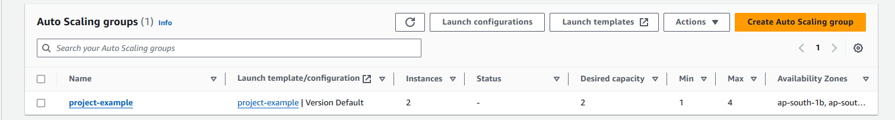

**Now the question comes, As we don't have public ipv4 addresses to these instances as we created those in private subnets, How do I login into those instances as I want to create my servers there only**

- Now, I created a bastion-host instance which can act as mediator between public and private subnets
- So, Inside the VPC, I created this bastion host giving permission to allow ssh port (where we login) (enabled auto-assign public ip address, as we have to login using that)
- As, I launched this host instance, I will first login to this host instance and from there I login to private instance.

**But to login, I need encrypted key right?, I have that in locally to login to host instance, but from there how to login to private instance without this key?**

**So, What I did is copied the key from local machine to host instance using scp (secure copy protocol)**

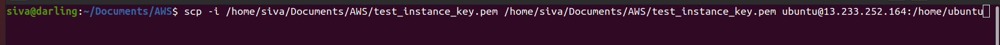

- Now, I logged into host using it's public ipv4 address

- 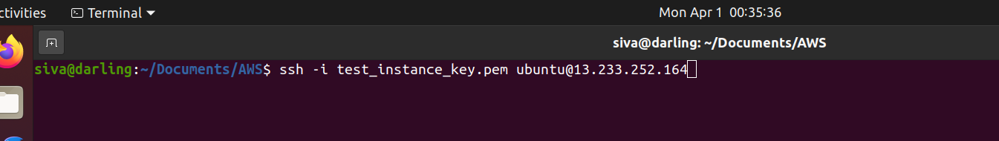

- See now, As I copied, I can see the key here

- 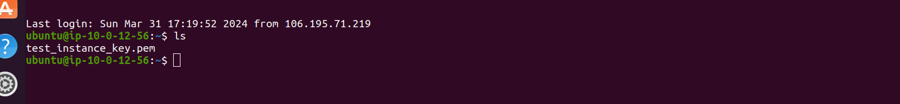

- And I use this key to login to private instance (instance which is in private subnet) using private ip address

- 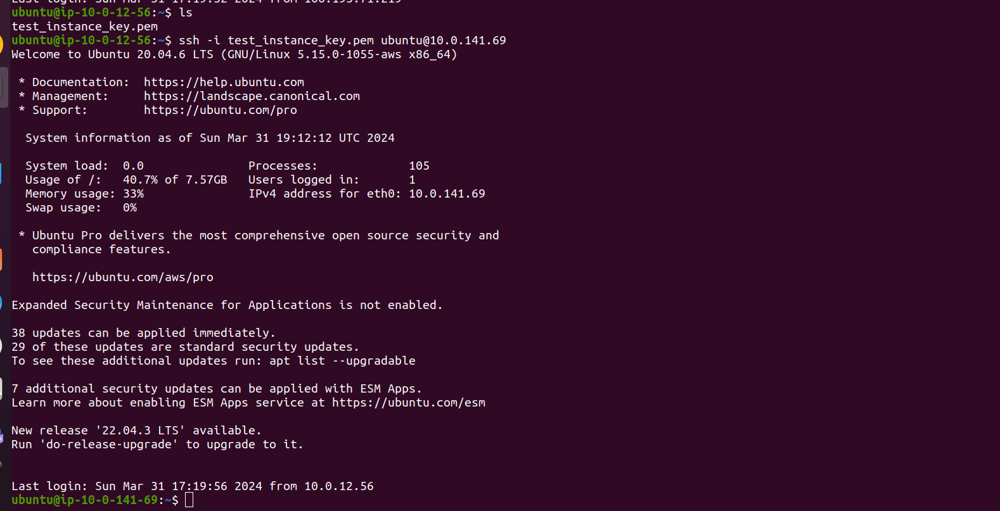

- And I ran my server inside that private instance

- 

- For now, I am running the server only in 1 private instance and there is no server in the other instance.

### 3. Now, Let's create a Loadbalancer and map it to two public subnets in the VPC

- Created an Application Loadbalancer (Layer 7 Loadbalancer), configured vpc, security group (for allowing specific traffic).
- I added a security group which allows ssh port 22, and http port 8000, where I am running server in that port 8000.
- Now, created a target group with specific instances we select to support loadbalancing (using http port: 8000, as I allowed already).
- Now, Create Loadbalancer by mapping to both public subnets and attach target group we created, and let's leave the accessible port of loadbalancer as 80 (HTTP port 80) for now.
- And the load balancer is created, but it shows that port is not accessible as we didn't allow http port 80 in any security group yet.
- Now change the configuration of security group of loadbalancer to allow traffic from http port 80, then that error is gone :)

### 4. Now, we can see that I implemented the full architecture as shown in architecture image:

- Abstraction: The DNS name abstracts the IP addresses of the individual servers behind the load balancer. Users or client applications don't need to know about the specific servers or their IP addresses; they only need to know the DNS name.
- Now, we use the DNS name of our loadbalancer to access the server.

### Remember, I am running the server in one private instance only, the other is for now unhealthy in target group

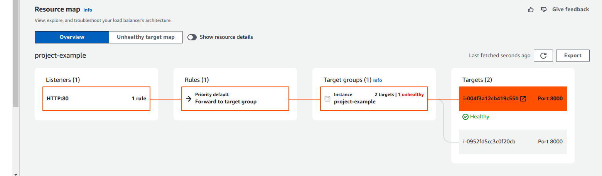

- Target group is doing health check and it is only forwarding the request to healthy loadbalancer.
- If we disable that health check, then it will send the server request to both instances. So, sometimes we get error and sometimes, we get the application.

### Let's Try using someother python basic server in other instance and check what happens

